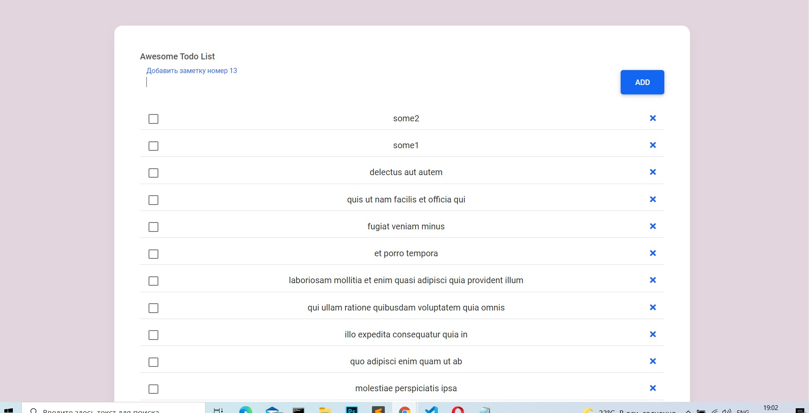

# To_do_on_vanila_js
To do list on vanila JS

Link online - http://test.cepos.ru/

Основные требования:
1. Вывод списка дел (задач)
2. Возможность создать задачу
3. Возможность отредактировать и удалить уже созданную задачу
4. Верстка и дизайн
(адаптивность не обязательна, но приветствуется)

Дополнительные задачи:
1. Загрузить список дел запросом к api:
https://gelltorn.github.io/interviewTestFakeApi/task.json илспользовался вот этот https://jsonplaceholder.typicode.com/todos
1. Возможность отметить задачу выполненной

!!! Использовался live server в VS code !!! (можно любой локальный сервер)
